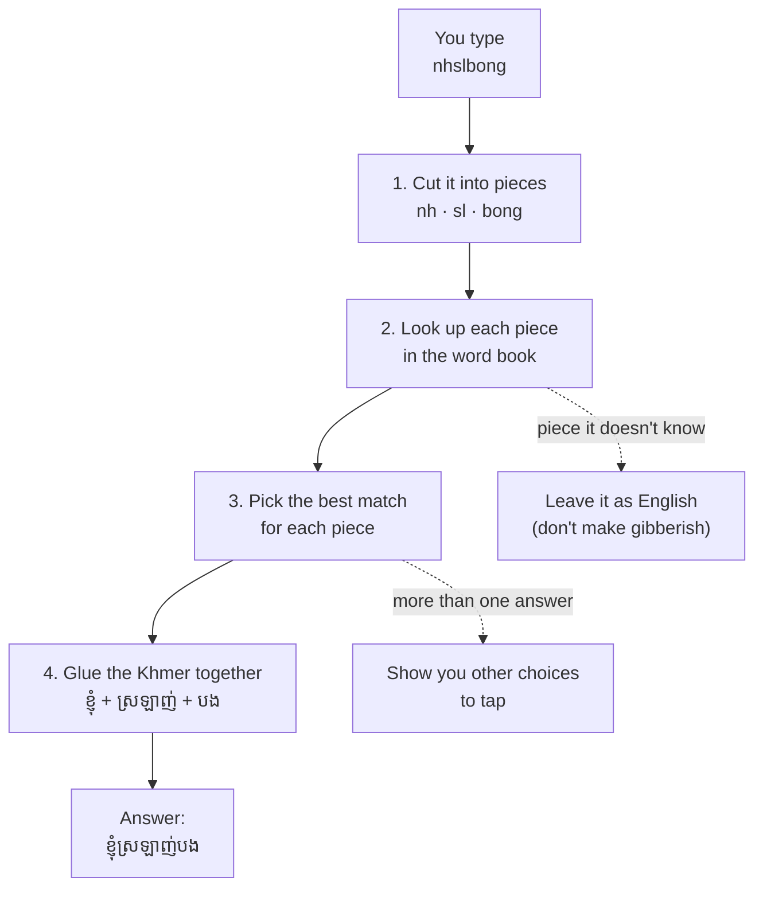

# How Sing Khmer works — explained simply (Phase 6)

Imagine you want to write Khmer (ខ្មែរ) but you only have an English keyboard. So you
"spell it out" with English letters — you type `nh` and you mean ខ្ញុំ ("I"). **Sing Khmer
is a little translator that turns your English-letter spelling into real Khmer writing.**

Here's the whole idea, the way you'd explain it to a friend.

## The picture

## Step by step

**1. Cut your typing into pieces.**
You might type with spaces (`nh sl bong`) or all stuck together (`nhslbong`). The engine is
smart enough to find the pieces either way — like reading *"itwasadarknight"* and knowing
it's *"it was a dark night."* It even tries a few different ways of cutting and keeps the
one that makes the best words.

**2. Look up each piece in a word book.**
There's a big list (`data/vocabulary.csv`) that says things like "`nh` means ខ្ញុំ" and
"`bong` means បង." The engine looks up every piece in that book.

**3. Pick the best match.**
Sometimes one spelling can mean two words (like how "bark" is a dog *and* a tree). When that
happens, the engine picks the one people use most often — but it remembers the others so you
can switch.

**4. Glue the Khmer together.**
Khmer words are written with no spaces between them, so the engine sticks the pieces into one
neat string: ខ្ញុំ + ស្រឡាញ់ + បង → **ខ្ញុំស្រឡាញ់បង** ("I love you").

## The clever extra tricks

- **A real space:** one space just separates your spellings. Want an *actual* space in the
  Khmer? Tap the spacebar **twice**.
- **Saying a word twice:** type `muy muy` and it writes **មួយៗ** — that little ៗ is the Khmer
  way of saying "again" (it's like writing "muy" and adding a *ditto* mark).
- **A word it doesn't know:** if you type something that isn't in the book (like a made-up
  word), it **leaves it alone** instead of turning it into nonsense.
- **English words:** if you type an English word like `ok` or `message`, it keeps it in
  English. And if a word could be *both* (like `computer` → កុំព្យូទ័រ), it shows you the
  English word too, so you can choose.

## Why not just use a "smart AI brain" (machine learning)?

A learning AI needs to see **thousands and thousands** of examples to get good. Right now our
word book has about 900 words — way too few. If we trained an AI on that, it would just
*memorize* the list and guess badly on everything else. So for now the **rules + the word
book** do the job, and they're easy to fix and fast on a phone. When the book grows much
bigger, we can try the AI and keep it *only if it actually does better*. (The details are in
[ML.md](ML.md).)

## The one-sentence version

> You type Khmer in English letters; Sing Khmer chops it up, looks each piece up in a word
> book, picks the best Khmer, and glues it together — and it's polite about spaces, repeats,
> unknown words, and English.
